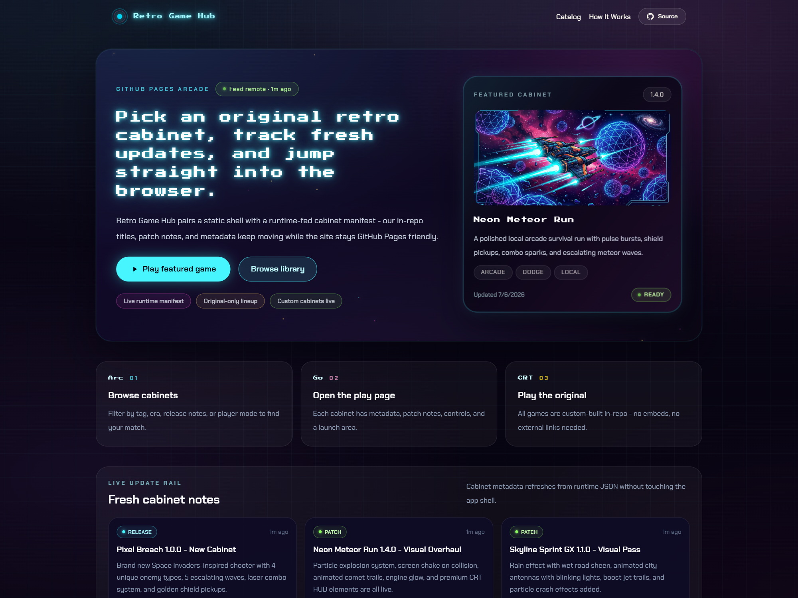
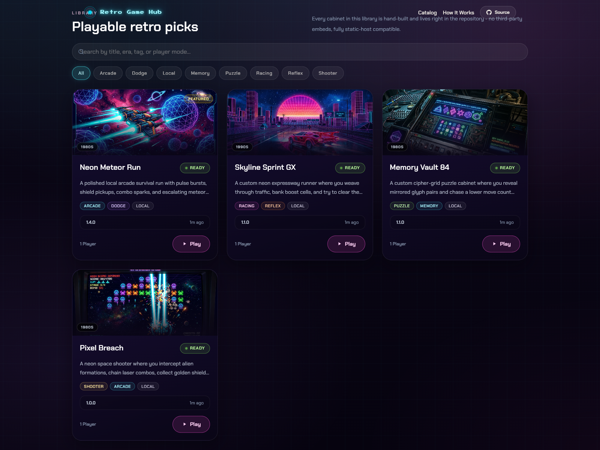
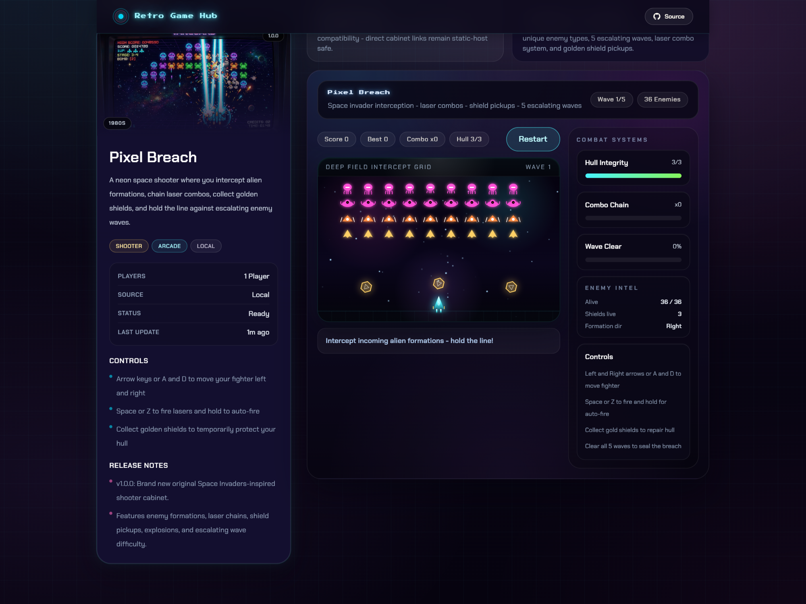
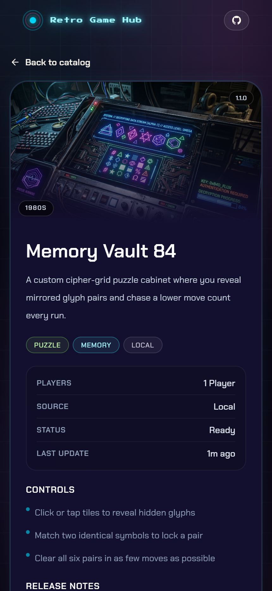

# Retro Game Hub

[](CHANGELOG.md)
[](docs/installation.md)
[](package.json)
[](package.json)
[](LICENSE)

Retro Game Hub is a static arcade library built for GitHub Pages. The app lets players browse a custom-built cabinet catalog, search and filter the lineup, open a dedicated game route, and play original in-repo browser games without leaving the site shell.

## What Ships Today

- Original-only cabinet lineup with four playable local games
- React + Vite + TypeScript single-page app with hash routing
- Tailwind CSS plus custom CRT, glow, and cabinet animation styling
- Runtime-fed catalog and update rail backed by static JSON
- Dedicated play pages with release notes, controls, and metadata
- Unit, integration, and end-to-end coverage
- GitHub Pages deployment workflow for static publishing

## Screenshots

### Home Hero



### Catalog Grid



### Cabinet Play Page



### Mobile Cabinet Layout



## Cabinet Lineup

| Cabinet | Genre | Core Loop | Status |
| --- | --- | --- | --- |
| `Neon Meteor Run` | Arcade dodge survival | Avoid meteor waves, trigger pulse bursts, collect sparks and shields | `ready` |
| `Skyline Sprint GX` | Reflex lane runner | Weave traffic, collect energy cells, spend boost cleanly | `ready` |
| `Memory Vault 84` | Memory puzzle | Match mirrored glyph pairs in the fewest moves possible | `ready` |
| `Pixel Breach` | Arcade shooter | Clear enemy formations, chain lasers, manage shields across waves | `ready` |

## Stack

- Node.js 24+
- React 19
- TypeScript 6
- Vite 8
- React Router with hash routes
- Tailwind CSS via `@tailwindcss/vite`
- Custom CSS for cabinet chrome, glow passes, scanlines, and motion
- Vitest + Testing Library
- Playwright

## Project Structure

```text
.
├─ docs/                    Project documentation and dated worklogs
├─ public/
│  ├─ data/                 Runtime-fed catalog and update JSON
│  └─ images/               Cabinet thumbnail and promo art
├─ src/
│  ├─ components/           Shell, hero, filters, cards, player surfaces
│  ├─ data/                 Bundled manifest fallback
│  ├─ games/                Local playable cabinet implementations
│  ├─ hooks/                Runtime feed polling
│  ├─ lib/                  Catalog parsing, validation, filtering helpers
│  ├─ routes/               Home, game, and not-found pages
│  └─ types/                Shared app contracts
├─ tests/e2e/               Playwright browser flows
└─ .github/workflows/       GitHub Pages deployment automation
```

## Getting Started

### Prerequisites

- Node.js 24 or newer
- npm 11 or newer
- Microsoft Edge installed locally for the checked-in Playwright configuration on Windows

### Install

```bash
npm install
```

### Run Locally

```bash
npm run dev
```

Open `http://localhost:5173/` in development.

### Production Build

```bash
npm run build
```

### Preview Production Output

```bash
npm run preview
```

## Available Scripts

- `npm run dev` starts the Vite dev server
- `npm run build` runs TypeScript compilation and creates the production build
- `npm run preview` serves the built `dist/` output locally
- `npm run lint` runs Oxlint
- `npm run test` starts Vitest in watch mode
- `npm run test:run` runs the Vitest suite once
- `npm run test:e2e` runs the Playwright suite

## Content Model

The catalog is driven by `GameEntry` records stored in both:

- [`src/data/games.json`](src/data/games.json) for bundled build-time fallback
- [`public/data/games.json`](public/data/games.json) for runtime refresh

The update rail is driven by:

- [`src/data/updates.json`](src/data/updates.json)
- [`public/data/updates.json`](public/data/updates.json)

Each game record includes:

- `id`
- `title`
- `slug`
- `description`
- `thumbnail`
- `tags`
- `era`
- `players`
- `controls`
- `sourceType`
- `playTarget`
- `featured`
- `status`
- `version`
- `lastUpdated`
- `releaseNotes`

The current shipped lineup is intentionally `local` only. The broader contract still supports future `embed` entries, but that path is not active in the present release.

## Adding or Updating a Cabinet

1. Update both manifest files: [`src/data/games.json`](src/data/games.json) and [`public/data/games.json`](public/data/games.json).
2. Update both feed files if release notes or update-rail copy changed: [`src/data/updates.json`](src/data/updates.json) and [`public/data/updates.json`](public/data/updates.json).
3. Add or refresh cabinet art in [`public/images`](public/images).
4. If the game is local, register its `playTarget` in [`src/lib/localGames.tsx`](src/lib/localGames.tsx).
5. Verify route lookup, search, and update rendering.
6. Run:

```bash
npm run lint
npm run test:run
npm run build
npm run test:e2e
```

## Testing

The current test stack covers:

- Manifest and runtime-feed parsing
- Search and tag filtering
- Slug lookup and missing-cabinet handling
- Catalog rendering and route navigation
- Local cabinet registry lookup
- Direct cabinet route rendering
- Runtime feed UI behavior

See [docs/Testing.md](docs/Testing.md) for the detailed test plan and current gaps.

## Deployment

The app is built for GitHub Pages and uses:

- Vite base path: `/Retro-game-hub/`
- Hash routing: `#/` and `#/game/:slug`
- GitHub Actions workflow: [`.github/workflows/deploy.yml`](.github/workflows/deploy.yml)

Important repository setting:

- GitHub Pages must be enabled in repository settings
- Build source must be set to `GitHub Actions`

See [docs/Deployment.md](docs/Deployment.md) for the full publish checklist and Pages failure notes.

## Documentation

- [Documentation index](docs/index.md)
- [Architecture](docs/architecture.md)
- [Features](docs/features.md)
- [Installation](docs/installation.md)
- [Troubleshooting](docs/troubleshooting.md)
- [Testing](docs/Testing.md)
- [Deployment](docs/Deployment.md)
- [API contract](docs/API.md)
- [Database notes](docs/Database.md)
- [Security](docs/Security.md)
- [Roadmap](docs/roadmap.md)
- [Current worklog](docs/worklogs/worklog-06-07-2026.md)

## Release Snapshot

- App version: `0.4.1`
- Catalog size: `4` original cabinets
- Hosting target: GitHub Pages
- Runtime model: static app plus runtime-polled JSON feeds

## License

Licensed under the Apache License 2.0. See [LICENSE](LICENSE).
